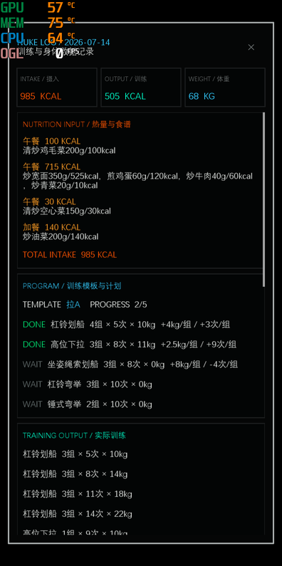

# Fitness Tracker — Black Titanium Control Terminal

基于 Kivy 的健身训练记录 App，支持 AI 饮食识别、核弹模板训练、热量收支计算。

## 界面截图

<p align="center">
  
  
  
  
</p>

## 功能

- **核弹训练**：预设推/拉/腿模板，一键部署今日计划，逐项完成后记录训练量
- **难度反馈**：每项完成后选"太吃力/正好/很轻松"，自动调整下次训练量
- **模板自动同步**：完成全部训练后，调整后的组数/次数/重量自动回写模板
- **AI 聊天**：支持文字/语音/图片输入，AI 可查任意历史数据、改模板、写饮食记录
- **热量追踪**：BMR/TDEE 计算、饮食摄入、运动消耗、体重趋势、热量赤字目标
- **日历热力图**：按日查看训练/饮食/身体数据的完整汇总
- **动作要领**：当前训练可查看对应离线动画和中文步骤说明
- **训练计时**：一键部署自动开始，全部完成自动冻结，重启后仍可见

## 技术栈

| 层 | 技术 |
|---|------|
| UI | Kivy 2.1.0 (黑色钛金 VFD 仪器风) |
| 数据库 | SQLite |
| AI | OpenAI 兼容 API (DeepSeek / MiMo) |
| 设计系统 | Black Titanium Fitness Control System |
| 打包 | Buildozer + python-for-android v2023.09.16 |
| 架构 | 根级 database.py 代理 → models/ 层 CRUD |

## 设计主题

软件采用 **Black Titanium Fitness Control System** 黑钛设备仪器风格：

- 橙色 VFD = 训练参数 / 目标 / 可调输入
- 青色 VFD = 分析 / 测量 / 历史趋势
- 蓝色 VFD = 导航 / AI / 系统 / 连接
- 红色 LED = 故障 / 危险 / 紧急
- 绿色 LED = 成功 / 完成 / 已连接
- 烟熏玻璃显示窗 + 精密机械矩形模块
- 克制呼吸灯：最多 1-2 枚/屏，+ 总线扫描指示

完整设计规范见桌面文档 `Black-Titanium-Fitness-Control-System-Agent.md`。

## 动作资料库

原生力量动作的中文说明、别名和媒体地址统一存储在
`assets/catalog/exercises.db`。当前训练卡通过原生动作名匹配对应条目，右上角
"动作要领"按钮可打开离线动画和中文步骤。运行时不会依赖写死动作清单；新增动作
时，将 `<source_id>.jpg` 和来源 GIF 放入对应目录并生成兼容的动画帧，再向 SQLite 插入
记录和别名即可。应用启动时会增量同步到用户数据库。媒体署名见
`assets/catalog/NOTICE.md`。

## 版本历史

### v1.9 (2026-07-23)

- **黑钛品牌 Logo**：重新设计的 FC 几何徽记，替换旧图标和 presplash
- **对称顶栏**：左侧 `ACTIVE CHANNEL`（日期 + 页面名 + 微型周时间表），中间 Logo，右侧 `SYSTEM BUS`（连接灯 + AI 灯 + 同步灯 + 扫描指示）
- **AI 状态灯**：未配置时橙色呼吸，配置完整后绿色
- **训练计时器**：部署自动开始，全部完成自动冻结并持久化
- **完成提示重写**：替换通用"训练完成"为实用的恢复建议和安全警示
- **日期详情弹窗**：点击日历热力图日期，弹出完整汇总（饮食、训练、身体、模板、热量）
- **AI 历史查询**：模型可通过 `get_date_overview` 工具查询任意日期的全部数据
- **战报触发时机修复**：只在真正全部完成后显示，部署时不再误报

### v1.8 (2026-07-22)

- **黑钛仪器 UI**：黑色钛金机箱 + VFD 语义色系统 + 烟熏玻璃显示窗
- **机械按键组件**：`MechanicalButton` 按 inset/command/danger/system 四种状态渲染
- **状态呼吸灯**：`StatusLamp` 模块，支持可配置颜色和呼吸动画
- **页面导航重绘**：PageBar 改为六段蓝色垂直模式选择器
- **首页升级**：NUKE + 当前训练双核心控制台，顶部系统状态条
- **冷启动自检**：约 0.8 秒 `FITNESS CONTROL TERMINAL` 硬件自检遮罩
- **训练卡 LED 进度条**：24 段 VFD 青色 LED 条
- **日历重绘**：矩形方形热力图格，0.18s 机械滑动过渡
- **统计数据面板**：青色分段 VFD 分析数据显示
- **AI 页面**：蓝色数据链路终端，气泡带 LOCAL TX / AI DATA RX 状态标签
- **点击音效**：短促电子机械接触声
- **修复多个布局问题**：日历底栏高度、步进器触控区域、AI 服务商网格、计划弹出窗动作名列数

### v1.7 (2026-07-22)

- **离线动作资料库**：新增 106 个动作的中文要领、别名、缩略图和离线动画帧；当前训练可直接查看动作示范
- **训练卡操作优化**：增大"动作要领"按钮与触控区域，改善小屏操作
- **核弹控制器重绘**：升级为带金属面板、校准刻度和辐射标志的机械控制器
- **界面可读性**：统一收紧圆角、提高关键文字字号；恢复主页横向工作台布局与 PageBar 导航
- **日历热力图修复**：修正行数与居中计算，扩大日期格并避免遮挡页面导航

### v1.6 (2026-07-21)

- **AI 饮食记录**：新增 `add_meal` 工具，口诉/打字吃了什么，AI 自动分析热量并写入今日摄入
- **模板自动同步**：完成全部训练后，调整量自动回写到核弹模板
- **难度反馈按钮**：完成此项拆为三按钮 [太吃力 | 正好 | 很轻松]
  - 太吃力 → 下次重量 -2.5kg
  - 正好 → 保持不变
  - 很轻松 → 次数 +1；若次数 ≥12 则重量 +2.5kg
- **watchdog.py**：开发用崩溃监听工具

### v1.5 (2026-07)

- AI 多模态修复：图片/音频 MiMo 兼容
- 热量公式重写：MET 标准公式替代原有估算
- 饮食管理：列出/删除/清空今日饮食

### v1.3 (2026-06)

- 初始版本：训练模板、计划部署、逐项完成、热量基础计算

## 运行

```bash
# 桌面端
pip install kivy==2.1.0 httpx
python main.py

# 打包 Android
buildozer android debug
```
